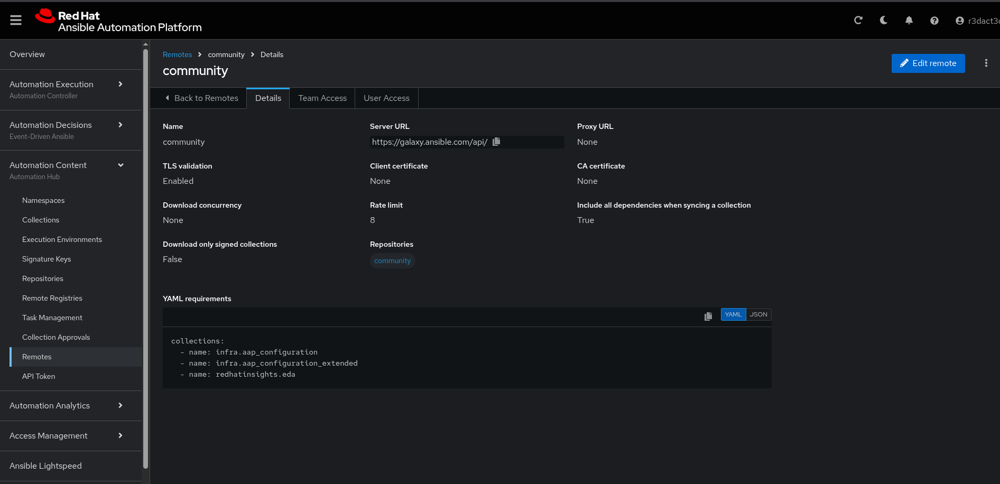
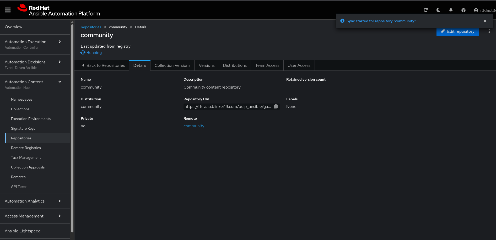

# Export Automation Controller Resources

- **filetree-create.yml** - Playbookes uses role from Red Hat Communities of Practice [aap_configuration_extended](https://github.com/redhat-cop/aap_configuration_extended/tree/devel/roles/filetree_create) collection

Ensure the following collections are listed in your Galaxy remote requirements:
- **infra.aap_configuration**
- **infra.aap_configuration_extended**

Then, sync the **community** repository for that remote config and double check that the repository sync *Completed*

If you have a config as code workflow in place, then you can use this varaible files to automate the AAP resource creation, like credentials, project, and templates.

[place-holder for cac templates]()
