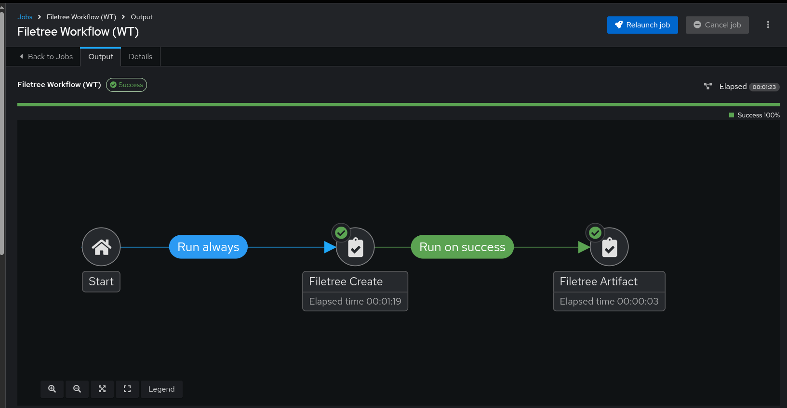
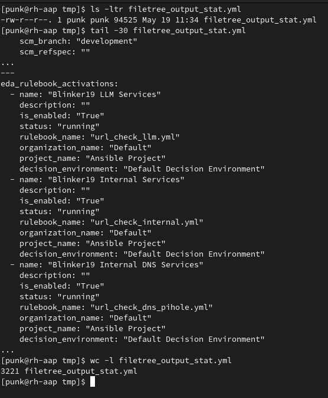

# Export Automation Controller Resources

- **filetree_create.yml** - Playbookes uses role from Red Hat Communities of Practice [aap_configuration_extended](https://github.com/redhat-cop/aap_configuration_extended/tree/devel/roles/filetree_create) collection
- **filetree_artifact.yml** - Reads stats from filetree_create.yml and exports to the local filesystem for processing/manipulation

Ensure the following collections are listed in your Galaxy remote requirements:
- **infra.aap_configuration**
- **infra.aap_configuration_extended**

Then, sync the **community** repository for that remote config and double check that the repository sync *Completed*

- If you have a config as code workflow in place, then you can use this varaible files to automate the AAP resource creation, like credentials, project, and templates.

  - [Variables for the dispatch or import roles](vars/dispatch_vars.yml)

- If you do not have a config as code workflow in place, then this is the first step in implementing "Infrastructure/Configuration as Code".

  - Ensure the resources reflected in the dispatch_vars.yml have been created:
    - **Inventory** - Add your automation controller for localhost and *optional* second host for export
    - **Project** -  points to Ansible Project repo
    - **Job Templates** -  points to the playbooks
    - **Workflow Templates** - runs the playbooks together

> NOTE: You will need to update the **Job Templates** with your **AAP Admin** and **Machine Credentials**

Once all the resources are in place, we can run the **Workflow Template**:

- First job exports the controller resources and sets the flattened data as a stat artifact
- Second job reads the stat artifact and copies it from the container to the host.
  - This can be a second Automation Controller for import or another tools hosts for data manipulation.

After the Workflow is completed successfully, you can login to the controller or host specified in the inventory to manipulate or see the controller resources defined as code.

Yours will reflect differently, because you will have different resources defined, but below we can see on my output that it captured my manually added EDA Rulebook Activations.

> Note: I added *ignore_errors* to get around issues with exporting *Decision Environments*

## Art of the Possible

